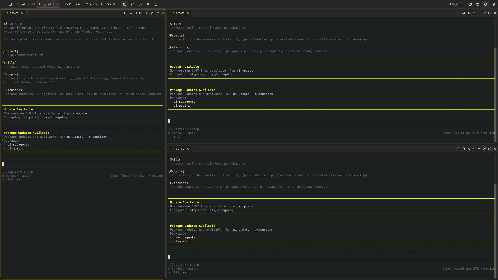

# muxel

**This is my reimagined version of the Muxel ADE.** It keeps the original's
core idea — a native desktop terminal multiplexer for running several coding
agents side by side — and rebuilds the experience around driving agents all
day: a single merged command bar, host-native window chrome, tiled and tabbed
panes that each embed a real terminal (Claude Code, opencode, Amp, pi, or a
plain shell), agent status at a glance, notifications when an agent finishes
or needs input, and first-class git-worktree flows — one window per branch, no
tmux keybindings required.

See [FEATURES.md](FEATURES.md) for the full feature catalogue, and
[docs/dev-main-workflow.md](docs/dev-main-workflow.md) for how this repo
develops itself: an installed "main" you drive daily, a sandboxed "dev" you
test uncommitted work in, and one command (`scripts/promote.sh`) to push dev
over main.

---

## Install & run

- **Release packages** — the release workflow builds Linux `.deb` / `.rpm` /
  AppImage / `.tar.gz` (x86_64 + aarch64); install the one matching your distro.
- **From source (this machine)** — `scripts/install.sh`: release-builds muxel,
  installs the binary to `~/.local/bin/muxel`, and registers the launcher icon +
  `.desktop` entry pointing at it. Run `muxel` from your launcher, or by name if
  `~/.local/bin` is on your `PATH`.
- **Ad hoc** — run the build-tree binary in place, without installing:
  `cargo run -p muxel` (debug) or `cargo build --release -p muxel &&
  ./target/release/muxel`. It uses your **real** workspace, so it's for quick
  checks; for parallel/sandboxed testing use `scripts/dev.sh` instead.
- **Linux system deps** — a Wayland or X11 stack, `libxkbcommon`,
  fontconfig/freetype, and D-Bus (desktop notifications + tray). `git` and
  `tmux` are optional integrations; each agent CLI is installed separately.

## Releases

Pushing a `v*` tag makes GitHub Actions build every package on native runners
and publish them to
[GitHub Releases](https://github.com/bencordeiro/muxel-pop/releases) with
auto-generated notes:

| Platform | Assets |
| --- | --- |
| Debian / Ubuntu | `.deb` (x86_64, aarch64) |
| Fedora / RHEL / openSUSE | `.rpm` (x86_64, aarch64) |
| Any Linux | AppImage or `.tar.gz` (x86_64, aarch64) |
| macOS (Intel + Apple Silicon) | one universal `.dmg` + `.zip` |

macOS builds are ad-hoc signed (no Developer ID), so Gatekeeper warns on first
launch: right-click → Open, or
`xattr -dr com.apple.quarantine /Applications/muxel.app`. Windows is
intentionally not packaged — support is being phased out.

## Dev / main workflow

muxel supports running an installed **main** and a sandboxed **dev** side by
side, so you can develop muxel *inside* muxel:

- **main** — the installed `~/.local/bin/muxel`, using your real workspace.
- **dev** — `scripts/dev.sh`: builds and runs against an isolated sandbox
  (`.muxel-dev/`), so testing never touches the real workspace. Safe to run in
  a pane of the running main. Args go to cargo (`--release`); anything after
  `--` goes to muxel.
- **promote dev → main** — `scripts/promote.sh`: release-builds the current
  tree and atomically swaps `~/.local/bin/muxel` (copy-then-rename, so it's
  safe even while main is running — the running process keeps its old inode).
  Restart main to pick up the new binary; the launcher entry needs no update.
- `MUXEL_BIN_DIR` overrides the install directory for both `install.sh` and
  `promote.sh`.
- Full notes, the two-instance rule, and a cheat sheet:
  [docs/dev-main-workflow.md](docs/dev-main-workflow.md).

## Scripts

| Script | Purpose |
| --- | --- |
| `scripts/dev.sh` | isolated dev instance (sandboxed config/data) |
| `scripts/install.sh` | one-time main install: binary + launcher entry |
| `scripts/promote.sh` | push the current dev tree over the installed main |
| `scripts/install-desktop.sh` | launcher icon + `.desktop` entry only (used by `install.sh`; `MUXEL_EXEC` overrides the Exec path) |
| `scripts/sign-macos.sh` | macOS signing / notarization |
| `scripts/translate.py` | i18n string extraction / translation helper |

---

- **Credits** — full credit to the original Muxel developers for building an ADE
  that invites people to build on it; this repo is my reimagined take on their
  foundation.

## License

muxel is **dual-licensed**:

- **Open source** — [GNU GPL-3.0](LICENSE): free to use, modify, and
  redistribute, provided any version you distribute is also released under
  GPL-3.0.
- **Commercial** — a separate license from **ProjectHax LLC** for use that can't
  comply with the GPL (e.g. embedding muxel in a closed-source product). See
  [LICENSING.md](LICENSING.md).

By submitting a contribution you agree to the terms in
[CONTRIBUTING.md](CONTRIBUTING.md), which keep both licenses possible.
